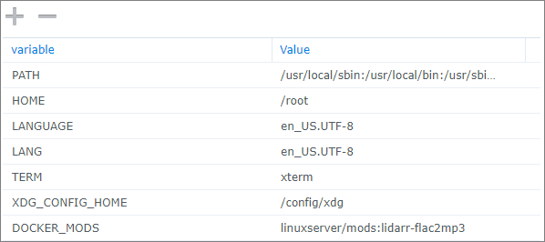

A [Docker Mod](https://github.com/linuxserver/docker-mods) for the LinuxServer.io Lidarr Docker container that uses ffmpeg and a script to automatically convert downloaded FLAC files to MP3s.  Default quality is 320Kbps constant bit rate.

>**NOTE:** This mod supports Linux OSes only.

Container info:

   

# Installation
1. Pull the [linuxserver/lidarr](https://hub.docker.com/r/linuxserver/lidarr "LinuxServer.io's Lidarr container") docker image from Docker Hub:  
  `docker pull linuxserver/lidarr:latest`

2. Configure the Docker container with all the port, volume, and environment settings from the *original container documentation* here:  
  **[linuxserver/lidarr](https://hub.docker.com/r/linuxserver/lidarr "Docker container")**
   1. Add the **DOCKER_MODS** environment variable to the `docker create` command, as follows:  
      `-e DOCKER_MODS=thecaptain989/lidarr-flac2mp3:latest`  

      *Example Synology Configuration*  
      

   2. Start the container.

3. After the above configuration is complete, to use ffmpeg, configure a custom script from Lidarr's *Settings* > *Connect* screen and type the following in the **Path** field:  
   `/usr/local/bin/flac2mp3.sh`

   *Example*  
   

   This will use the defaults to create a 320Kbps MP3 file.

   *For any other setting, you **must** either user one of the [included wrapper scripts](./README.md#included-wrapper-scripts) or create a custom script with the command line options you desire.  See the [Syntax](./README.md#syntax) section below.*

## Usage
New file(s) with an MP3 extension will be placed in the same directory as the original FLAC file(s) and have the same owner and permissions. Existing MP3 files with the same track name will be overwritten.

If you've configured Lidarr's **Recycle Bin** path correctly, the original audio file will be moved there.  
![danger] **NOTE:** If you have *not* configured the Recycle Bin, the original FLAC audio file(s) will be deleted and permanently lost.

### Syntax
>**Note:** The **Arguments** field for Custom Scripts was removed in Lidarr release [v0.7.0.1347](https://github.com/lidarr/Lidarr/commit/b9d240924f8965ebb2c5e307e36b810ae076101e "Lidarr commit notes") due to security concerns.
To support options with this version and later, a wrapper script can be manually created that will call *flac2mp3.sh* with the required arguments.

The script accepts three command line options:

`[-d] [-b <bitrate> | -v <quality>]`

The `-b bitrate` option sets the output quality in constant bits per second (CBR).  
The `-v quality` option sets the output quality using a variable bit rate (VBR) where `quality` is a value between 0 and 9, with 0 being the highest quality.  See the [FFmpeg MP3 Encoding Guide](https://trac.ffmpeg.org/wiki/Encode/MP3) for more details.  
If neither `-b` nor `-v` options are specified, the script will default to constant 320Kbps.

The `-d` option enables debug logging.

### Examples
```
-b 320k        # Output 320 kbit/s MP3 (non VBR; same as default behavior)
-v 0           # Output variable bitrate, VBR 220-260 kbit/s
-d -b 160k     # Enable debugging, and output 160 kbit/s MP3
```

### Included Wrapper Scripts
For your convenience, several wrapper scripts are included in the `/usr/local/bin/` directory.  
You may use any of these scripts in place of the `flac2mp3.sh` mentioned in the [Installation](./README.md#installation) section above.

```
flac2mp3-debug.sh        # Enable debugging
flac2mp3-vbr.sh          # Use variable bit rate, quality 0
```

### Example Wrapper Script
To configure the last entry from the [Examples](./README.md#examples) section above, create and save a file called `wrapper.sh` to `/usr/local/bin` containing the following text:
```
#!/bin/bash

. /usr/local/bin/flac2mp3.sh -d -b 160k
```
Then put `/usr/local/bin/wrapper.sh` in the **Path** field in place of `/usr/local/bin/flac2mp3.sh` mentioned in the [Installation](./README.md#installation) section above.

### Triggers
The only events/notification triggers that have been tested are **On Release Import** and **On Upgrade**

### Logs
A log file is created for the script activity called:

`/config/logs/flac2mp3.txt`

This log can be downloaded from Lidarr under *System* > *Log Files*

Log rotation is performed, with 5 log files of 1MB each kept, matching Lidarr's log retention.
>![danger] **NOTE:** If debug logging is enabled, the log file can grow very large very quickly.  *Do not leave debug logging enabled permanently.*

## Credits
This would not be possible without the following:

[Lidarr](https://lidarr.audio/ "Lidarr homepage")  
[LinuxServer.io Lidarr](https://hub.docker.com/r/linuxserver/lidarr "Lidarr Docker container") container  
[LinuxServer.io Docker Mods](https://hub.docker.com/r/linuxserver/mods "Docker Mods containers") project  
[ffmpeg](https://ffmpeg.org/ "FFMpeg homepage")  
Icons made by [Freepik](https://www.freepik.com) from [Flaticon](https://www.flaticon.com/)

[warning]: .assets/warning.png "Warning"
[danger]: .assets/danger.png "Danger"
